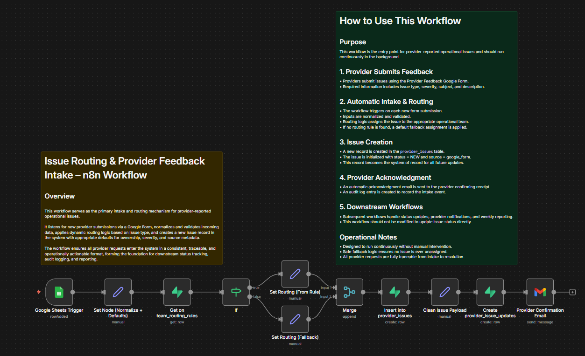
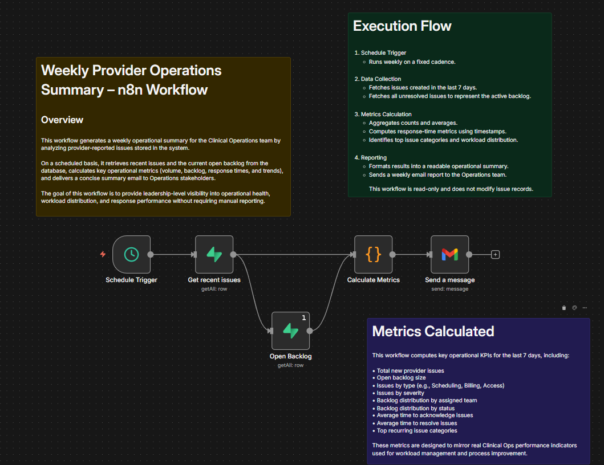
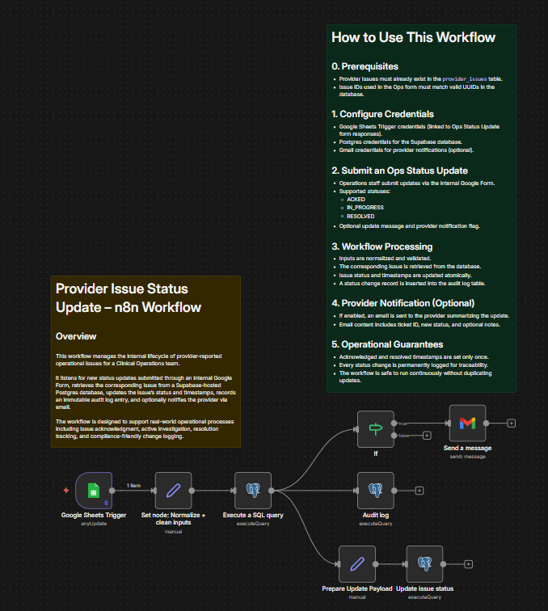

# Issue-Routing-Provider-Service 📍📍📍
Automated intake, tracking, and resolution workflow for provider-reported operational issues.  This project simulates a real-world Clinical Operations support system using Google Forms, n8n, Supabase/Postgres, and Gmail.

This project simulates a real-world Clinical Operations support system using
Google Forms, n8n, Supabase/Postgres, and Gmail.

---

## Why this project
Clinical Ops teams handle a high volume of provider-reported issues (scheduling,
billing, technical access, etc.). This system demonstrates:

- Structured issue intake
- Status lifecycle tracking
- Audit logging for compliance
- Optional provider notifications
- Weekly operational summaries

Designed to mirror real internal tooling used by healthcare operations teams.

---

## System Overview

**Flow:**
1. Provider submits feedback via Google Form
2. Issue is stored in Supabase (`provider_issues`)
3. Ops team updates issue status via internal form
4. Status changes are logged (`provider_issue_updates`)
5. Optional provider notification is sent
6. Weekly summary aggregates open/resolved issues

---

## Workflows

### 01 – Provider Feedback Intake
- Trigger: Google Form → Google Sheets
- Normalizes inputs
- Inserts new issue into `provider_issues`

### 02 – Issue Status Update (Ops)
- Trigger: Internal Ops Google Form
- Updates issue status (`ACKED`, `IN_PROGRESS`, `RESOLVED`)
- Manages timestamps (`acknowledged_at`, `resolved_at`)
- Writes immutable audit log
- Optional provider email notification

### 03 – Weekly Ops Summary
- Scheduled workflow
- Aggregates issue metrics
- Generates AI-assisted summary
- Sends ops report via email

---

## Database Schema

Main tables:
- `provider_issues`
- `provider_issue_updates`

See `database/schema.sql` for full definitions.

---

## Google Forms

### Provider Feedback Form
Used by providers to submit operational issues (scheduling, billing, access).

🔗 https://docs.google.com/forms/d/e/1FAIpQLSdYP-MGAUHWBxbptryYUtoOVanegJ3V_3P0tiyogAkGC3Xfxg/viewform

### Ops Issue Status Update Form
Internal form used by Operations to update issue status.

🔗 https://docs.google.com/forms/d/e/1FAIpQLScLtFXo6D3-B_ZF6JR8BOYj87dNfAJ6W5GnuqttgsgoiEKebA/viewform

## Example Scenarios

Located in `/examples`:
- Provider submits scheduling issue
- Ops acknowledges issue (no email)
- Ops resolves issue (email sent)

---

## Tech Stack

- n8n (workflow orchestration)
- Supabase (Postgres)
- Google Forms + Sheets
- Gmail
- SQL
